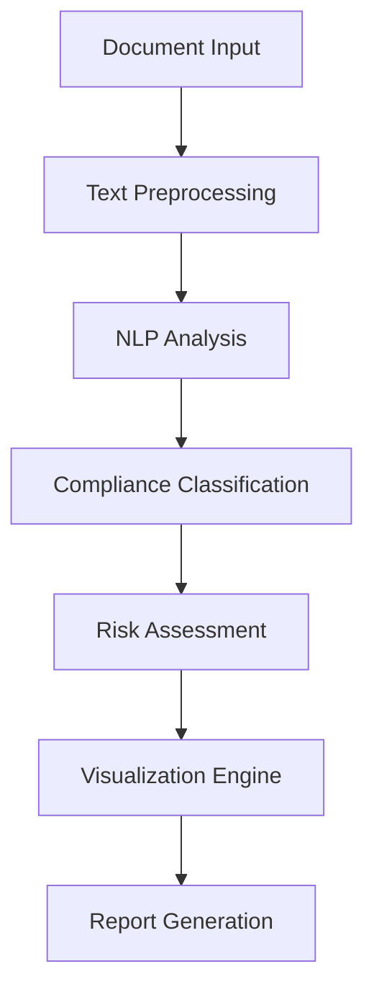

# CompliSync – Automating Compliance, Simplifying Security

#I'm trying to upload one of the dataset zip file but its not getting uploaded on git even tried with git lfs so here's the drive link for it please dowload it and add to the dataset folder 
  

## 📌 Overview
CompliSync is an AI-driven compliance automation tool that streamlines the process of regulatory adherence. Using advanced NLP models, it automatically extracts, analyzes, and validates security policies against frameworks like **GDPR, HIPAA, and PCI DSS**. The system enhances efficiency by offering real-time risk assessments and actionable insights, reducing manual efforts while ensuring regulatory compliance.

## 🎯 Key Objectives

- 📑 **Policy Extraction**: Develop sophisticated methods for automatically extracting relevant information from privacy policy texts using advanced NLP techniques
- 🤖 **GDPR Classification**: Implement and train state-of-the-art NLP models for accurate GDPR compliance classification
- 📊 **Model Evaluation**: Conduct comprehensive evaluation of various NLP models for identifying and interpreting regulatory principles
- 🔄 **Continuous Monitoring**: Establish automated systems for ongoing compliance monitoring and updates
  
## 🎯 Core Features

### 📑 Intelligent Policy Extraction
- Automatically detects and structures regulatory clauses from legal texts.
- Advanced NLP-based sentence tokenization and entity recognition.

### 🤖 Compliance Classification
- AI models map extracted policies to GDPR, HIPAA, and PCI DSS standards.
- Risk scoring based on detected compliance gaps.

### 📊 Interactive Compliance Dashboard
- Real-time compliance monitoring.
- Graphical insights into policy adherence trends.

### 📜 AI-Generated Reports
- Detailed compliance summaries with risk assessments.
- Exportable reports for auditing and documentation.

## 🛠 Technical Architecture




## 🚀 Getting Started
### Prerequisites
Ensure your environment has the following:
```bash
Python 3.10+
PyTorch
spaCy
Transformers
NLTK
```

### Installation Steps
1. **Clone the Repository**
```bash
git clone https://github.com/YourRepo/CompliSync.git
cd CompliSync
```
2. **Set Up Virtual Environment**
```bash
python -m venv venv
source venv/bin/activate  # Windows: venv\Scripts\activate
```
3. **Install Dependencies**
```bash
pip install -r requirements.txt
```
4. **Download NLP Models**
```bash
python -m spacy download en_core_web_sm
python -m nltk.downloader punkt
```

### Running the Application
**Command Line Interface:**
```bash
python gdpr_compliance_checker.py sample_policy.txt
```
## 📸 Screenshots
### Report Summary


